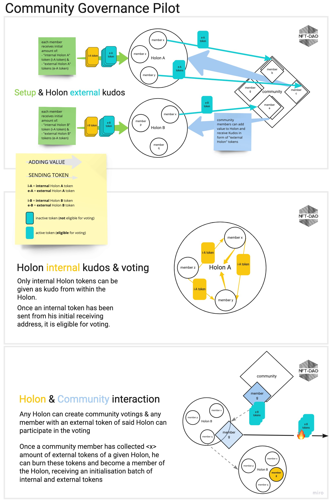

# 7th April, 2021, NFT-DAO General Meeting

## 7th April, 2021, NFT-DAO General Meeting



Note: timestamps are external links

## Beginning of Fund 5 - [0.02](https://youtu.be/wnVupMQtjp4) - Tyler Wales

| Present |
| :--- |
| Rich Kopcho |
| Tyler Wales |
| Troy Egan |
| Dan Verowski |
| New MIndflow |
| Philip Roberts |
| Stephen Rowan |

> Philip introduced Patrick to Yagi - [0.44](https://youtu.be/wnVupMQtjp4?t=44) - **Philip Roberts**

## Growth Update - [1.16](https://youtu.be/wnVupMQtjp4?t=76) - Tyler Wales

> We have seen a lot of growth since the funding process started :

|  |  |
| :--- | :--- |
| **Discord community** | 296 Members |
| **Airtable form** | 36 People signed up |
| **Artist Registrations for the first auction** | 22 Artists |
| **Developers signed up via Airtable form** | 11 Developers |
| **Email list** | 387 Subscribers |
| **Twitter** | 292 Followers |

> We hope to accelerate this growth, looking at things like policy scripts \(process logic\) and wireframes \(interface design\)
>
> We are on track but need to pick up the pace.
>
> Make sure we are actively removing silos in our various workflows \(marketing, governance\).
>
> Make extra effort to be as transparent as we can with each other.

## Product Update - [3.11](https://youtu.be/wnVupMQtjp4?t=191) - Tyler Wales

> Deliver completed mock-ups to Yagi for branding, get some colours figured out.
>
> Put together basic prototype flowchart \(without colours\)
>
> Hopefully we will have a polished product for the MVP

## Token Minting - [4.16](https://youtu.be/wnVupMQtjp4?t=256) - Dan Verowski

> Issues with minting token on Daedalus, problems with the CLI \(command line interface\)
>
> Created small visual for comparison of NFT with Ethereum \(for Twitter post\)

> Working with Jonathan Looney to create first mock-ups for wireframes.

## Artist Outreach - [5.28](https://youtu.be/wnVupMQtjp4?t=328) - New Mindflow

> Contacted Artists, including African Artists who have some good potential to create some quality works.
>
> Working on Color Schemes / Graphics for the Launch Page of the Auction MVP \(Minimum Viable Product\)

> Produced video to celebrate getting funded
>
> Andy produced a meme as well :

## Token Minting reprise - [6.49](https://youtu.be/wnVupMQtjp4?t=409) - Tyler Wales, Dan Verowski

> In Slack channel The Ancient Kraken had minted an NFT-DAO test token - **Tyler Wales**
>
> On GitHub Troy mentioned **Triaging** the expertise level - **Dan Verowski**
>
> **Summary** : Maybe we could have two tokens for each HOLON ...

* An **internal token** \(collected by those eligble for voting on HOLON decisons\) and, 
* an **external token** \( collected by individuals outside the HOLON\)

> **Context** :



> Now raised as a separate Issue :



### Can we use Yoroi wallet for token minting ? - [9.20](https://youtu.be/wnVupMQtjp4?t=560) - Rich Kopcho



> Not sure if Yoroi wallet supports Native Multiple Assets yet- [9.25](https://youtu.be/wnVupMQtjp4?t=565) - **Dan Verowski, Tyler Wales**
>
> Answer : Yoroi wallet does not currently support tokens



### Can we get a visual diagram of how "Triaging" tokens works ? - [9.59](https://youtu.be/wnVupMQtjp4?t=599) - **Tyler Wales**

> Governance token distribution model is a Fund 3 Milestone - would be good to give this back to the community.
>
> Graphic now produced :

**Reference** : Fund 3 Deliverable Milestones \(Gov-HOLON\)



## Governance HOLON Update  - [10.38](https://youtu.be/wnVupMQtjp4?t=638) - **Troy Egan**

### Progress reports

> Getting ready for **progress reports** which Rich Kopcho will be starting next week.

| - | - |
| :--- | :--- |
| **Item** | Getting ready for **progress reports** |
| **Data** |  |
| **Action** | In Progress |
| **Dates** | Due: 15th April 2021 |
| **HOLON** | Gov-HOLON |

> We will be handing reports to D? -

| - | - |
| :--- | :--- |
| **Item** | We will be handing reports to D? |
| **Data** |  |
| **Action** | In Progress |
| Dates | Due: 15th April 2021 |
| HOLON | Troy / Rich Kopcho |

### Reporting template

> Getting a template ready for that so we understand the reporting process

| - | - |
| :--- | :--- |
| **Item** | Reporting process template. |
| _\*Data_ |  |
| **Action** | In Progress |
| Dates | Due: 15th April 2021 |
| HOLON | Gov-HOLON |

### HOLON Reporting

> Also how to receive reports from within the HOLONs

| - | - |
| :--- | :--- |
| **Item** | Reports from within the HOLONs. |
| **Data** |  |
| **Action** | To Do |
| **Dates** | TBA |
| HOLON | Gov-HOLON |

### Business Analysis

> Intial Business Analysis - Hope to have the draft finalised by next week. Which will give us an outline of our market/competition.

| - | - |
| :--- | :--- |
| **Item** | Intial Business Analysis. |
| **Data** |  |
| **Action** | In Progress |
| **Dates** | Due: 15th April 2021 |
| **HOLON** | Sev, Hud |

### Token Minting Test

> Token Minting Test - [11.51](https://youtu.be/wnVupMQtjp4?t=711) - **Troy Egan, Dan Verowski**
>
> Goal to get a contribution token minted and up and running in a two week timeframe. **The Ancient Kraken** and **Hud** are also interested in getting involved. Anyone else working in the Token Minting community who is interested should contact **Dan Verowski**.
>
> **Dan Verowski** will contact **The Ancient Kraken** and **Hud**.

| - | - |
| :--- | :--- |
| **Item** | Token Minting Test |
| **Data** | [Project Board](https://github.com/NFT-DAO/Governance-HOLON/projects/5) |
| **Action** | In Progress |
| **Dates** | Due: 23rd April 2021 |
| **HOLON** | Dan Verowski |

### Business Plan

> Business Plan - [12.43](https://youtu.be/wnVupMQtjp4?t=763) - **Troy Egan, Stephen Rowan**
>
> Stephen Rowan working on decomposing the Business Plan

| - | - |
| :--- | :--- |
| **Item** | Business Plan Decomposition |
| **Data** | [Project Board](https://github.com/NFT-DAO/Governance-HOLON/projects/3) |
| **Action** | In Progress |
| **Dates** | Due: 23rd April 2021 |
| **HOLON** | Stephen Rowan |

### NFT-DAO Mission Statement

> NFT-DAO Mission Statement - [13.05](https://youtu.be/wnVupMQtjp4?t=785) - **Troy Egan**
>
> To give us a clearer idea of the sources and directions of our ideas and processes.

| - | - |
| :--- | :--- |
| **Item** | NFT-DAO Mission Statement |
| **Data** | - |
| **Action** | In Progress |
| **Dates** | Due: 23rd April 2021 |
| **HOLON** | Gov-HOLON |

### NFT-DAO Charter

> NFT-DAO Charter - [13.24](https://youtu.be/wnVupMQtjp4?t=804) - **Troy Egan**
>
> Already been put out into the community for contribution and review. Changed name from manifesto to charter early on after feedback from **New Mindflow**.
>
> Building out a document structure of 1-3 pages \([GitHub Review Copy](https://github.com/NFT-DAO/Governance-HOLON/blob/main/05-Our-Values/Documents/Charter/Draft-Charter.md)\)
>
> **Rich** - this is drawn from the "Genesis Document" \([GitHub Copy](https://github.com/NFT-DAO/Governance-HOLON/blob/main/13-Our-Appendix/Documents/2021-02-03-Genesis-Document.md)\). Also sourced from [The Holonic Enterprise as a Collaborative Information Ecosystem](http://theimpactinstitute.org/Projects/FIPA/Holonic-Enterprise-Final.pdf) and [Sample DAO Charter - Alexander Kuzmin](https://medium.com/token-suisse/sample-dao-charter-c59f5396ceea).

| - | - |
| :--- | :--- |
| **Item** | NFT-DAO Charter |
| **Data** | [Project Board](https://github.com/NFT-DAO/Governance-HOLON/projects/4), [Milestones](https://github.com/NFT-DAO/Governance-HOLON/milestone/3) |
| **Action** | In Progress |
| **Dates** | Due: 22th April 2021 |
| **HOLON** | Gov-HOLON |

> What is the timeline of the charter ? - [14.05](https://youtu.be/wnVupMQtjp4?t=845) - **Rich Kopcho / Troy Egan**
>
> **Deadline**: Reschedule to 22nd April 2021 \(Was two weeks from 1st April 2021\)
>
> **Rich** will aim to have something ready for Gov-HOLON - week beginning 19th April 2021.
>
> [GitHub Reschedule Comment](https://github.com/NFT-DAO/Governance-HOLON/issues/29#issuecomment-816634615)

### Gov-HOLON Meeting

> Gov-HOLON Meeting Discussions - [14.42](https://youtu.be/wnVupMQtjp4?t=882) - **Troy Egan**

* **Minute Taking Rota** - so not on all on the shoulders of one person
* **Meeting Chair Rota** - so not on all on the shoulders of one person - **Tyler Wales**
* **FOSS repositories** \(GitHub\) what should be public or private ? - **Stephen Rowan**

Reference : README message in "Governance-HOLON Vault" Private repository

> Scope
>
> This repository should only contain :
>
> * Draft work to be migrated to the LIVE Governance-HOLON repository
> * Commercially or strategically sensitive information.
> * Confidential information \(but please avoid posting personal data here\).

* **White Paper** - Unsure about timeframe, priority, deadline. As it is a more in-depth document. - **Troy Egan**

  > Anyone wishing to contribute should contact Gov-HOLON.

> Draft White paper currently located in samepage. Requires input from Development at some point.

## GitHub Overview  - [17,02](https://youtu.be/wnVupMQtjp4?t=1022) - **Stephen Rowan**

> Beginning the process of open sourcing as per Fund 3 proposal commitments.
>
> We currently have 4 Gov-HOLON projects \([Gov-HOLON Project List](https://github.com/NFT-DAO/Governance-HOLON/projects)\) on the public [Governance-HOLON](https://github.com/NFT-DAO/Governance-HOLON) repository.
>
> Aiming to transfer Gov-HOLON deliverables to GitHub Project Boards, then break these down further into tasks \(GitHub Issues\) and then allocate Issues to HOLON members.
>
> This week Gov-HOLON had its first community call-out on Discord as an experiment to see how GitHub Issues might work. Starting with the Issue [Draft NFT-DAO Charter \#29](https://github.com/NFT-DAO/Governance-HOLON/issues/29).
>
> Currently building project dashboards on the [Governance-HOLON](https://github.com/NFT-DAO/Governance-HOLON) landing page for people not familiar with GitHub.

### Open-Source recognition

> Began with Open-Source recognition criteria :

| - | - |
| :--- | :--- |
| **Item** | Open-Source recognition |
| **Data** | [Project Board](https://github.com/NFT-DAO/Governance-HOLON/projects/1), [Milestones](https://github.com/NFT-DAO/Governance-HOLON/milestone/1) |
| **Action** | In Progress |
| **Dates** | Due: 30th April 2021 |
| **HOLON** | Gov-HOLON, Stephen Rowan |

### NFT DAO Fund 3 Deliverables

> Then NFT DAO Fund 3 Deliverables :

| - | - |
| :--- | :--- |
| **Item** | NFT DAO Fund 3 Deliverables |
| **Data** | [Project Board](https://github.com/NFT-DAO/Governance-HOLON/projects/2), [Milestones](https://github.com/NFT-DAO/Governance-HOLON/milestone/2) |
| **Action** | In Progress |
| **Dates** | No due date |
| **HOLON** | Gov-HOLON, Stephen Rowan |

### Business-Plan-Decomposition

> Then a functional breakdown of the Business Plan into organizational units \(Business-Plan-Decomposition\)
>
> Taking each section of the Business Plan and :

* working out who should be the best person \(HOLON members\) delegated that section
* how it breaks down into scope \(what the section covers\)
* how it allocates to tasks \(or issues\)
* and how it can be transferred to open-source

Reference :

| - | - |
| :--- | :--- |
| **Item** | Business-Plan-Decomposition |
| **Data** | [Project Board](https://github.com/NFT-DAO/Governance-HOLON/projects/3), [Milestones](https://github.com/NFT-DAO/Governance-HOLON/milestone/4) |
| **Action** | In Progress |
| **Dates** | April 14, 2021 |
| **HOLON** | Gov-HOLON, Troy, Stephen Rowan |

### NFT-DAO-Charter

> and finally the NFT-DAO-Charter

| - | - |
| :--- | :--- |
| **Item** | NFT-DAO-Charter |
| **Data** | [Project Board](https://github.com/NFT-DAO/Governance-HOLON/projects/4), [Milestones](https://github.com/NFT-DAO/Governance-HOLON/milestone/3) |
| **Action** | In Progress |
| **Dates** | April 22, 2021 |
| **HOLON** | Gov-HOLON |

### How this will inform our reporting

> Maybe we don't need our reports then ? - [19.16](https://youtu.be/wnVupMQtjp4?t=1156) - **Dan Verowski**, **Stephen Rowan**
>
> Hoping that this will inform our reporting.
>
> This is just the beginning, so we are still having teething problems with how people not used to GitHub use it and how to allocate work. But hopefully it’s the beginning of quantifying what we are doing so when it comes to tokenization we have data available.

## Discussion

### Idea of Triaging Consensus Levels arose out of comments on the NFT-DAO Charter Issue - [20.03](https://youtu.be/wnVupMQtjp4?t=1203) - **Troy Egan**

> HOLONs need to consider, for the AGILE/innovative stage of a project, what information do we need public/community consensus on and what tasks/actions to we need just HOLON consensus on. In an emergent process some of our tasks/actions can be slowed down by the process of community input we are committed to. Sometimes a lot of the community are not engaged or are just new.
>
> Started doing flowchart around :
>
> * onboarding process - how people/members come on Discord and engage
> * consensus - amongst new people/members
> * How are we triaging levels of engagement
>
> These factors also tie into our tokenization model.
>
> Do we need a communications HOLON that is keeping everyone on the same page? A HOLON that could triage what should be allocated to public/community consensus or what should be private. Also look at how contribution tokens are attached to a triaging model.
>
> Also look at what should be distributed/heterarchical and what should be hierarchical.

| - | - |
| :--- | :--- |
| **Item** | Triaging Consensus Levels |
| **Data** | -- |
| **Action** | In Progress |
| **Dates** | 14th April, 2021 |
| **HOLON** | Troy Egan |

Reference :



### Charles Hoskinson's Roadmap  - [24.23](https://youtu.be/wnVupMQtjp4?t=1463) - **Stephen Rowan**

> We are currently a Plutocratic model and need to move to a Hybrid model.
>
> Source : "Also going to launch a research agenda to move from a Plutocratic model \(ADA's current status\) to a Hybrid model \(ADA plus Proof of Merit\). Proof of Merit is a very ill-defined concept - consequentially deliverable is closer to 2025 than 2021." \([Source](https://stephen-rowan.gitbook.io/nft-dao/governance/dao-models#some-musings-about-the-roadmap)\)

### Did Charles refer to Cardano and did he say "Autocracy" - [24.23](https://youtu.be/wnVupMQtjp4?t=1554) - **Rich Kopcho**

> **Correction** : Stephen said "Autocracy" when Charles actually said "Plutocratic model" - \(apologies\). 
> 
> *Autocracy* = rule by one dictator / *Plutocracy* - rule by by people of great wealth or income.
>
> He was speaking tongue-in-cheek - **Stephen Rowan**
>
> He was speaking tongue-in-cheek, in that the Cardano projects have all started off from a point of centralised authority to get things done. But the aim of Cardano,  unlike other centralised authorities, is self-destructive, in that it aims to dissolve itself.

### Communication Discussion - [27.22](https://youtu.be/wnVupMQtjp4?t=1642) - **Rich Kopcho**, **Troy Egan**

> Did you mean communication to the outside world or inside the HOLON? -  **Rich Kopcho**

> I meant a Communication HOLON directed internally - **Troy Egan**

